# NBA Regression
## Summary
The main purpose of this study was to determine which on-court stats are the most influential to winning basketball games and by doing so, use these variables to make predictions on team performance. Many theories on the matter exist, for example some older theories claim that defense is most influential. Conversely, modern theories claim that 3 point shooting is most important. This study concluded that there is merit to both aforementioned theories and the most influential on court stats are: field goal %, 3 point %, offensive rebounds, defensive rebounds, assists, blocks, steals, turnovers, and personal fouls. The statistical method used was multiple linear regression and the fit criteria used was the AIC. Final regression coefficient output: 

 ## Data Acquisition
 The data used in this study was gathered from https://www.basketball-reference.com. This site has a plethora of different NBA stats and allows you to download as a CSV file.

 ## Data Preparation
 Since basketball-reference.com posts the data on a per season basis each CSV I downloaded only contained one season. I wanted 15 seasons in order to have a large enough data set to separate it into a train and test set. However, I did not want to include any seasons beyond 20 years old as these may skew the data. For example, many rules have changed over the years, affecting the gameplay and therefore the stats.

In terms of data cleaning, there were no missing or incomplete values. All the data was numeric except for team name.

## Data Analytics
Before carrying out any linear regression I conducted a thorough exploratory data analysis (EDA). First I evaluated the distribution of each numeric variable to determine whether it was normally distributed. If a variable is not linear distributed it must be transformed. In this data set all variables were distributed normally, therefore no transformations had to be done. Examples of distributions of two variables:
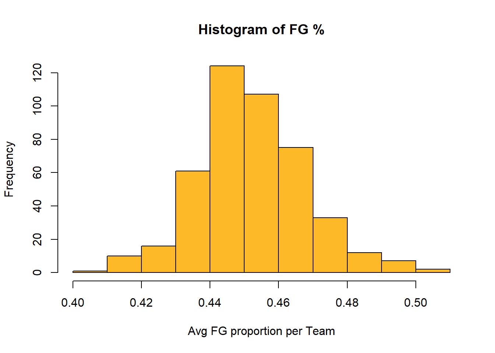
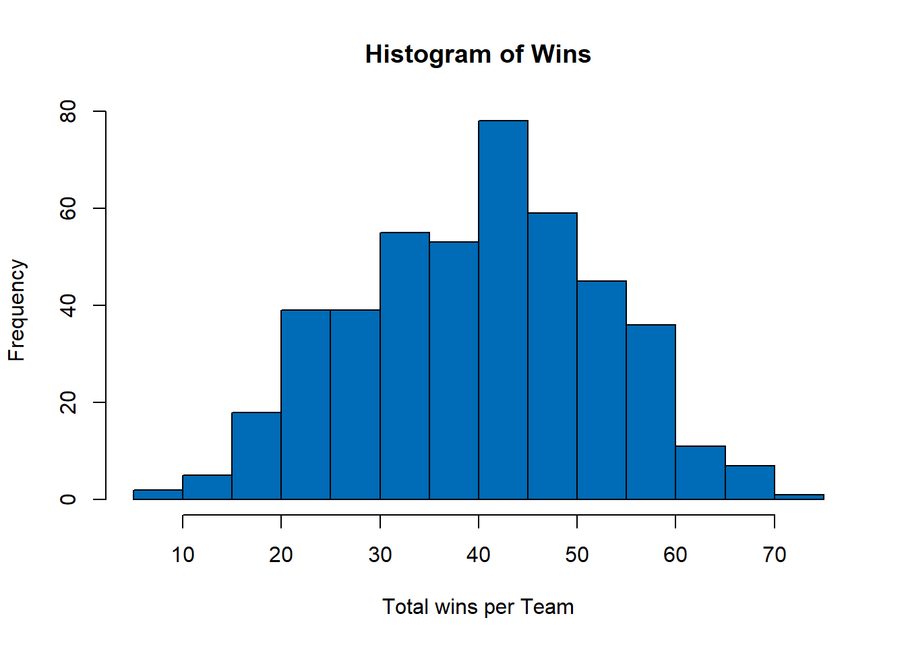

Next, I examined patterns and correlations between the numeric variables. If any two predictor variables had a correlation greater than +-0.4 they could not be included together in the regression. I also looked at correlations with independent variables and the dependent variable to inform my regression decisions. An example of four scatterplots:

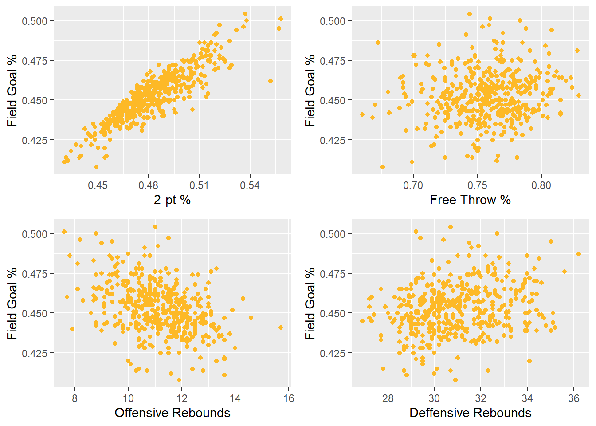

Correlation Matrix:

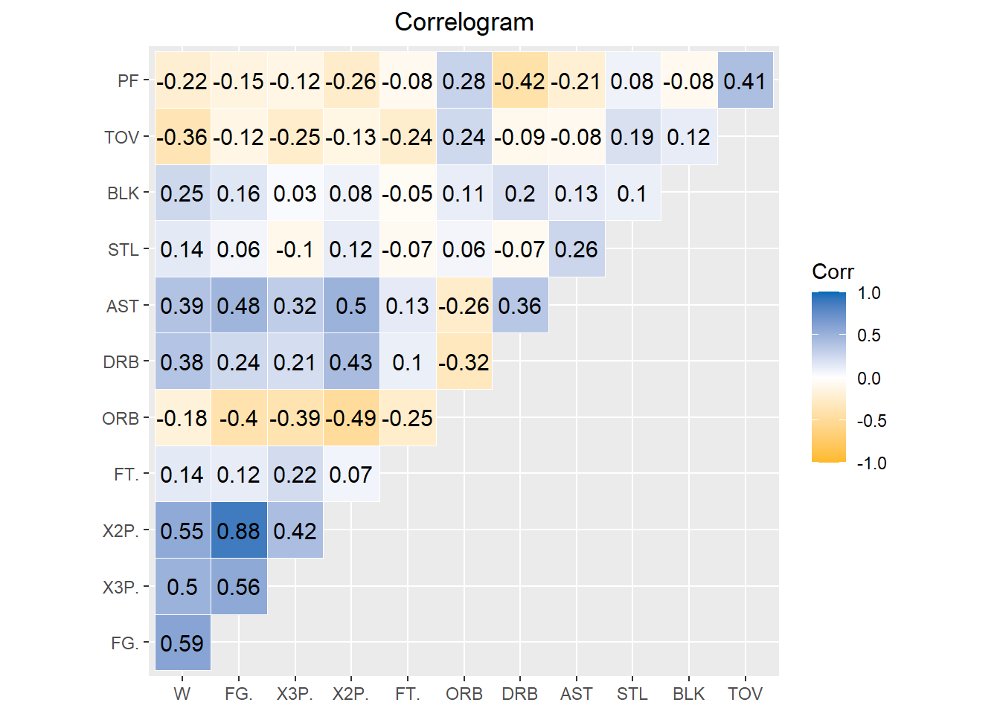

I then examined some time series patterns to inform my regression decisions. Evaluating certain variables across the 15 seasons. Two examples:

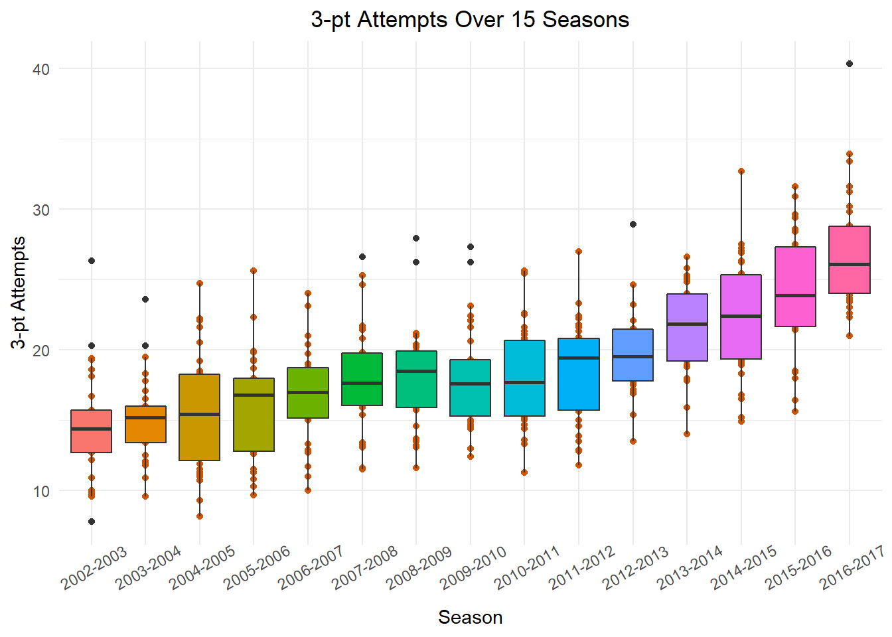
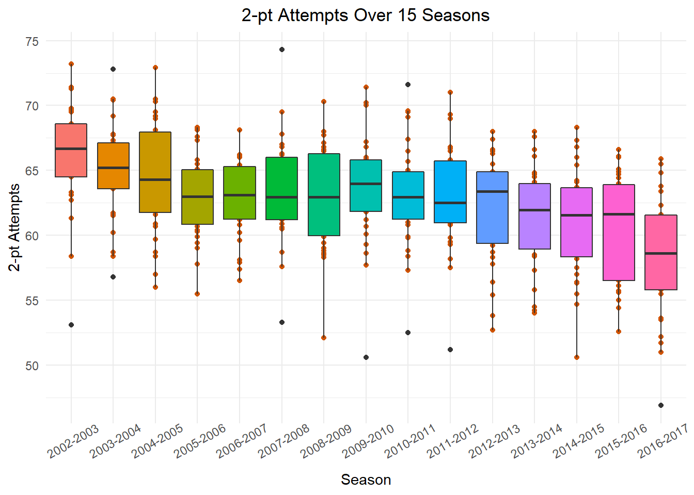

After completing the EDA I proceeded to conduct multiple linear regression. I manually performed stepwise backward selection starting with all independent variables and removing ones that were deemed statistically insignificant based on p-values greater than 0.05. Each time I removed variables I evaluated the models fit based on the Akaike Information Criterion (AIC). Subsequently choosing the model with the lowest AIC and therefore best fit. All variables included in the final model had p-values less than 0.05 except for 2: assists and personal fouls. Though these variables had p-values outside of the typical significance range of 0.05 the AIC was lower with them included. Plot of the model predictions:

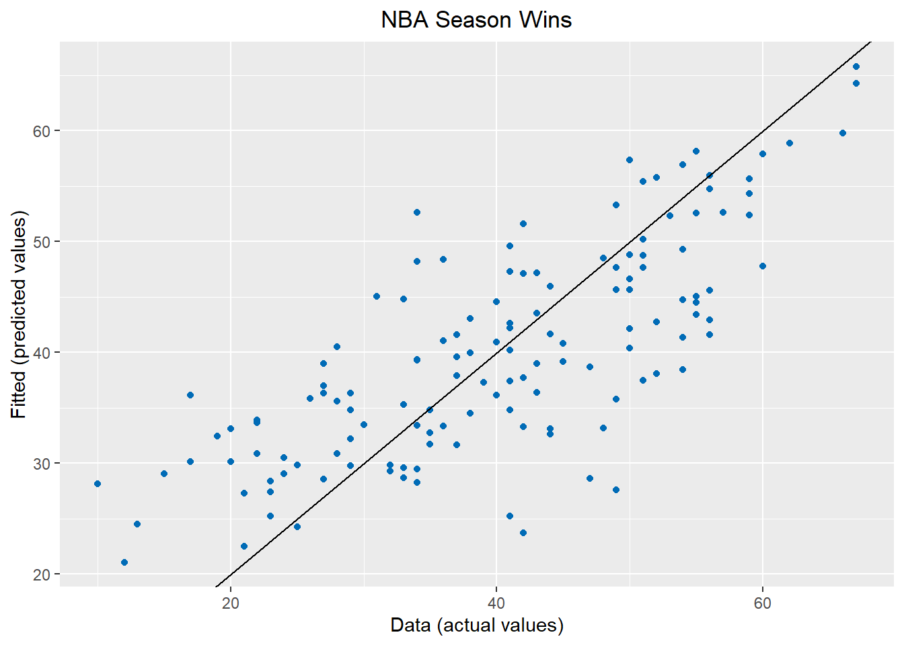

Finally the model's performance was evaluated by looking at the behaviour of the residuals. We can see in the below plots the residuals show no signs of heteroskedasticity.

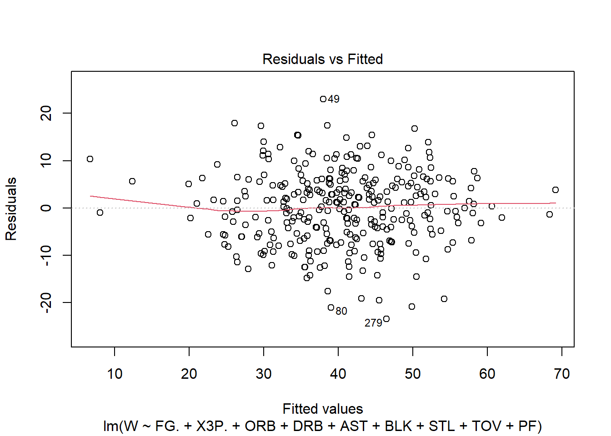
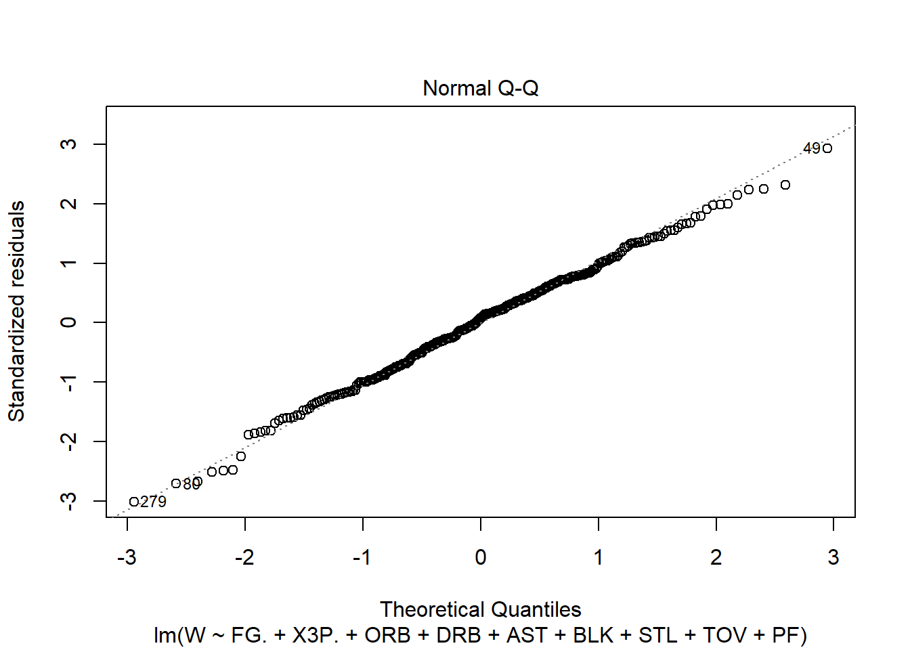

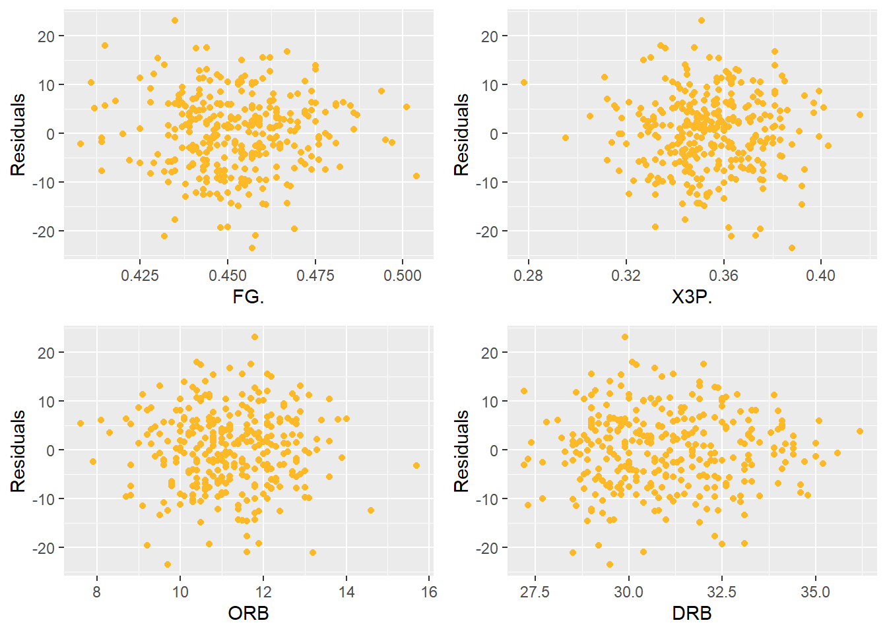
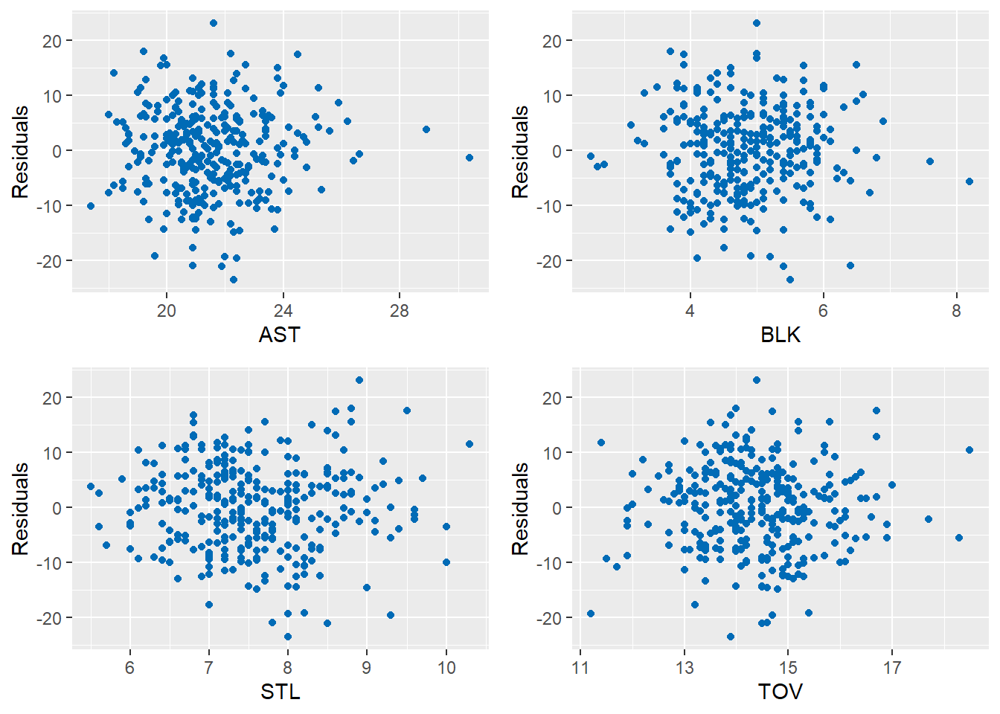
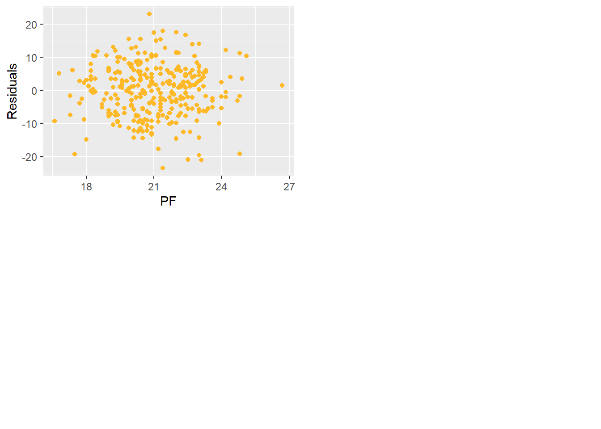
